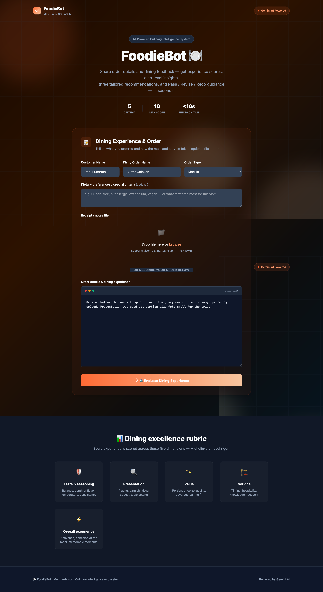
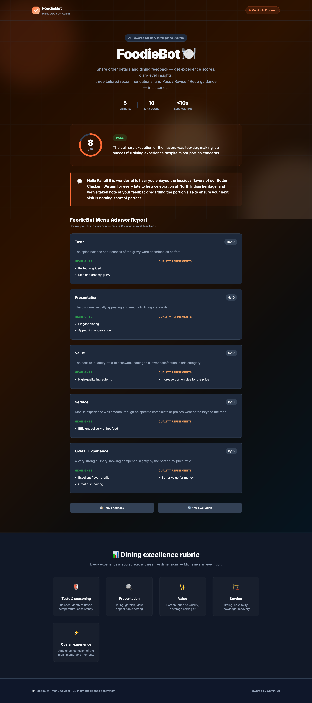
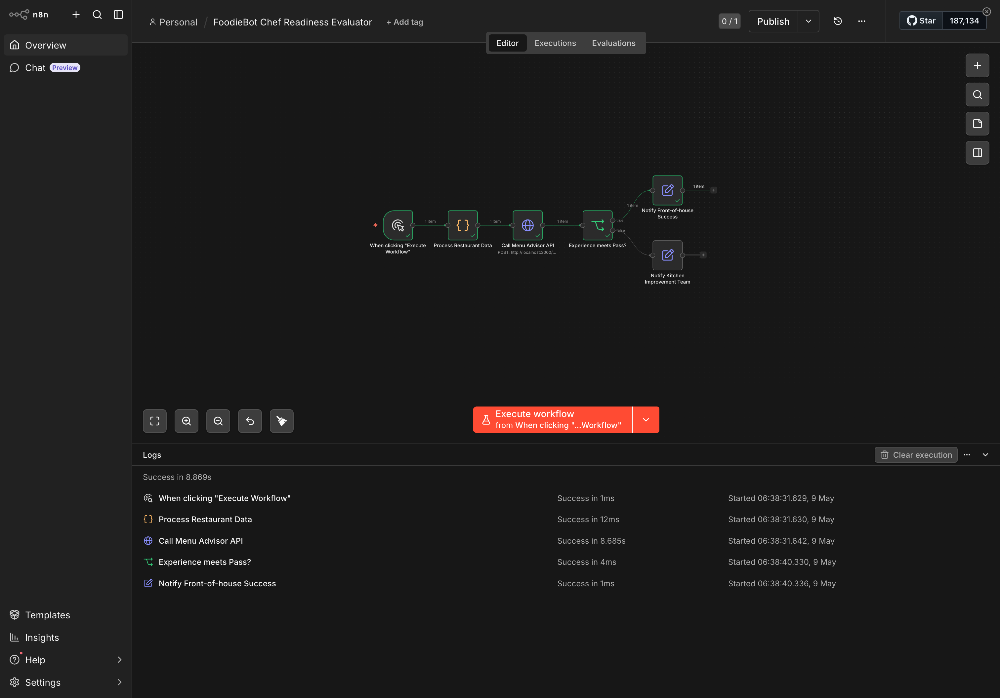
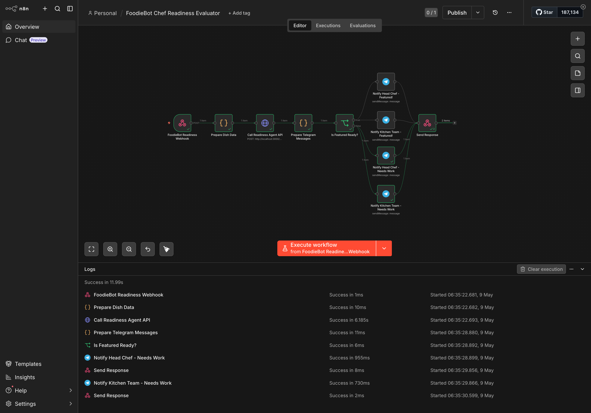

# FoodieBot: AI Multi-Agent Restaurant Intelligence System

An AI-powered restaurant management ecosystem that automates the full culinary pipeline — from dish evaluation and customer feedback to weekly performance analytics and Chef's Special promotions.

## 🚀 Objective
Eliminate the "quality bottleneck" in restaurant management. Specialized AI agents provide instant, expert-level dish evaluation, customer sentiment analysis, and personalized menu recommendations at scale.

## 🛠 Requirements
- AI Engine: Google Gemini API (`gemini-2.0-flash`)
- Backend: Node.js & Express.js
- Frontend: Premium Glassmorphism UI
- Automation: n8n for multi-channel notifications (Telegram, Slack)

## 🔄 Workflow & Agents

1. **Menu Advisor Agent** (replaces Agent 03): Evaluates daily customer orders and dining experiences. Provides dish-level feedback and personalized recommendations.
2. **Restaurant Analytics Agent** (replaces Agent 04): Generates weekly restaurant performance reports every Sunday — covers revenue trends, popular dishes, customer satisfaction.
3. **Chef Readiness Agent** (replaces Agent 06): Determines if a dish is ready for "Chef's Special" status and assigns it to the featured menu based on quality tier.

## 🔗 n8n Integration

### Key Workflow Files
- `n8n-workflow.json`: Manages Weekly Restaurant Performance Reports
- `n8n-readiness-workflow.json`: Manages Chef's Special Readiness Evaluations

### Workflow Logic
- **Webhook Trigger**: Receives data from Express backend when evaluation completes
- **HTTP Request Node**: Calls `/api/evaluate-readiness` for structured JSON evaluation
- **Conditional Logic (IF Node)**:
  - **Tier 3 – Featured Ready**: Triggers Telegram notification to Head Chef for menu promotion
  - **Tier 1/2 – Needs Refinement**: Triggers notification to Kitchen Team with improvement notes
- **Telegram/Slack Nodes**: Formats AI report into a rich chat message

## 📂 Implementation Details
- Server: `server/index.js` — all API logic and Gemini integration
- UI: `public/` — glassmorphic interfaces for customers and restaurant managers
- Styles: `public/style.css` — unified professional design system

## 📸 Screenshots

### Main Dashboard – Submit Dining Experience

### AI Evaluation Result

### n8n Report Workflow 

### n8n Readiness Workflow

## 🌍 Impact
FoodieBot democratizes Michelin-star level quality evaluation for every restaurant — providing instant expert feedback on dishes, accelerating menu innovation and customer satisfaction.
